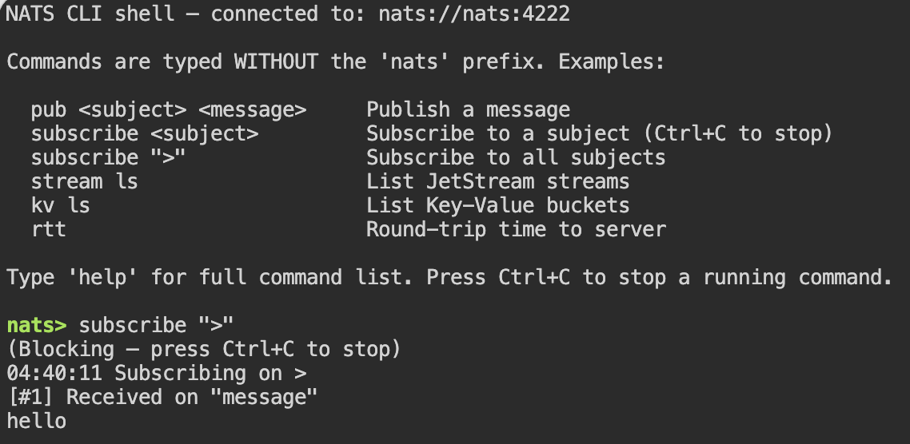

# nats-remote-control

A Docker Compose stack that exposes a NATS monitoring dashboard and a browser-accessible NATS CLI terminal — enabling remote management and observability of a NATS server without installing any local tooling.



## Overview

`nats-remote-control` spins up three services:

| Service | Port | Purpose |
|---|---|---|
| `nats` | 4222 / 8222 | NATS server with JetStream enabled |
| `nats-cli` | 7681 | Browser-based interactive NATS CLI shell (via ttyd) |
| `nats-dashboard` | 8000 | Web UI for NATS server monitoring |

Open a browser, connect to port **7681**, and run NATS commands directly — no client installation required.

---

## Technology Stack

| Component | Version |
|---|---|
| [NATS Server](https://nats.io/) | configurable via `NATS_VERSION` env var |
| [NATS CLI](https://github.com/nats-io/natscli) | 0.3.0 |
| [ttyd](https://github.com/tsl0922/ttyd) | latest |
| [rlwrap](https://github.com/hanslub42/rlwrap) | via Alpine apk |
| [nats-dashboard](https://github.com/mdawar/nats-dashboard) | configurable via `NATS_DASHBOARD_VERSION` env var |
| Alpine Linux | 3.19 (base image for nats-cli container) |
| Docker Compose | v2+ |

---

## Getting Started

### Prerequisites

- [Docker](https://docs.docker.com/get-docker/) with Docker Compose v2+

### Run

```bash
git clone https://github.com/arulrajnet/nats-remote-control.git
cd nats-remote-control
docker compose up -d
```

### Access

| Interface | URL |
|---|---|
| NATS CLI Web Shell | http://localhost:7681 |
| NATS Monitoring Dashboard | http://localhost:8000 |
| NATS Server (client connections) | nats://localhost:4222 |

### Stop

```bash
docker compose down
```

To also remove persistent volumes (command history, JetStream data):

```bash
docker compose down -v
```

---

## Project Structure

```
nats-remote-control/
├── docker-compose.yaml       # Defines nats, nats-cli, and nats-dashboard services
├── nats-cli/
│   ├── Dockerfile            # Multi-stage image: downloads ttyd + nats binary, installs rlwrap
│   ├── nats-eval.sh          # Bash eval loop shell — the interactive NATS CLI entrypoint
│   └── test.sh               # Manual shell-parsing tests
├── docs/
│   └── nats-cli-web-shell.md # Detailed design doc for the web shell component
├── LICENSE
└── README.md
```

---

## Key Features

- **Zero-install CLI access** — interact with NATS from any browser at `http://localhost:7681`
- **Prefix-free commands** — type `pub orders.new '{}'` instead of `nats pub orders.new '{}'`
- **Readline editing** — arrow-key navigation and line editing via `rlwrap`
- **Persistent command history** — saved to a named Docker volume; survives container restarts
- **Safe Ctrl+C** — interrupts the current command (e.g., a subscription) without killing the shell session
- **Blocking command hints** — `sub`, `subscribe`, `bench`, `reply` display `(Blocking — press Ctrl+C to stop)`
- **Screen clear** — `clear` / `cls` works without the `clear` binary
- **Quoted argument handling** — `pub topic "hello world"` is parsed correctly
- **System command guard** — `server` and `auth` subcommands redirect to the monitoring dashboard
- **Session persistence** — `exit` / `quit` keep the session alive; close the tab to disconnect
- **JetStream enabled** — NATS server starts with `-js` flag and persists data to a named volume
- **Multi-arch image** — Dockerfile supports `amd64`, `arm64`, and `armv7`

---

## Using the Web Shell

1. Open **http://localhost:7681** in a browser.
2. The prompt displays the connected NATS URL and example commands.
3. Type commands **without** the `nats` prefix:

```
nats> pub orders.new '{"id": 1}'
nats> subscribe orders.>
nats> stream ls
nats> kv ls
nats> rtt
```

4. Press **Ctrl+C** to stop a blocking command (subscribe, bench, reply).
5. Use **↑ / ↓** arrow keys to navigate history.
6. Type `help` for the full nats-cli command reference.
7. Close the browser tab to disconnect — the shell session stays alive on the server.

---

## Configuration

Environment variables can be set in a `.env` file alongside `docker-compose.yaml`:

| Variable | Default | Description |
|---|---|---|
| `NATS_VERSION` | _(required)_ | NATS server Docker image tag, e.g. `2.10` |
| `NATS_DASHBOARD_VERSION` | _(required)_ | nats-dashboard image tag |
| `NATS_URL` | `nats://nats:4222` | NATS URL used by the CLI shell |

**Example `.env`:**

```env
NATS_VERSION=2.10
NATS_DASHBOARD_VERSION=latest
```

---

## Building the nats-cli Image

```bash
docker build \
  --build-arg NATS_CLI_VERSION=0.3.0 \
  --build-arg TTYD_VERSION=latest \
  -t arulrajnet/nats-cli:0.3.0 \
  nats-cli/
```

---

## Architecture

```
Browser
  │
  ├─► :7681  ──► ttyd ──► nats-eval.sh (bash eval loop + rlwrap)
  │                              │
  │                              └──► nats binary ──► NATS Server :4222
  │
  └─► :8000  ──► nats-dashboard ──► NATS HTTP API :8222
```

- **ttyd** serves the terminal over HTTP/WebSocket.
- **rlwrap** wraps `nats-eval.sh` to provide readline editing and persistent history at `/data/.nats_history`.
- **nats-eval.sh** strips the `nats` prefix, handles SIGINT, and forwards commands to the `nats` binary.
- The `nats` binary reads `NATS_URL` from the environment — no `--server` flag needed.
- **nats-dashboard** reverse-proxies the NATS HTTP monitoring endpoint (`/proxy/`) to avoid CORS issues.

---

## Contributing

1. Fork the repository.
2. Create a feature branch: `git checkout -b feat/my-feature`
3. Make changes — keep shell scripts POSIX-compatible where possible; document any new nats-eval.sh behaviours in `docs/nats-cli-web-shell.md`.
4. Test against both `amd64` and `arm64` if modifying the Dockerfile.
5. Open a pull request.

---

## License

[MIT](LICENSE) © 2026 Arul

## Author

<p align="center">
  <a href="https://x.com/arulrajnet">
    
  </a>
  <br>
  <strong>Arul</strong>
  <br>
  <a href="https://x.com/arulrajnet">
    
  </a>
  <a href="https://github.com/arulrajnet">
    
  </a>
  <a href="https://linkedin.com/in/arulrajnet">
    
  </a>
</p>
